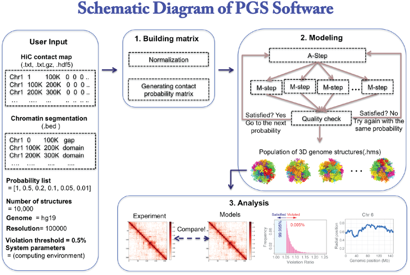

.. PGS: Population of Genome Structures documentation master file, created by
   sphinx-quickstart on Wed Sep  7 16:04:00 2016.
   You can adapt this file completely to your liking, but it should at least
   contain the root `toctree` directive.

PGS: Population-based Genome Structures modeling tools package
==============================================================

PGS is a population-based 3D genome-modeling package implemented by python. 
The software takes Hi-C matrix and chromosome regions segmentation or topological associated domains(TADs) information, 
which then generates an ensemble of structure population. The software also automatically generates analysis reports, 
such as structure quality based on scoring parameters, plots of radial positions and contact frequency maps from the structures. 
The whole codes are wrapped in python, and users can simply execute it one time. 

.. note:: PGS software will run on high performance computing environment (HPC), such as sun grid engine and TORQUE (pbs script), as well as local machine. But, it is highly recommended to run on HPC because of computational resource and running time.

The code is open source, and `available on github <https://github.com/alberlab/pgs>`_.

Here is the overview of PGS pipeline:

Contents:

.. toctree::
   :maxdepth: 2
   
   quickstart
   results
   faq
    

* :ref:`genindex`

