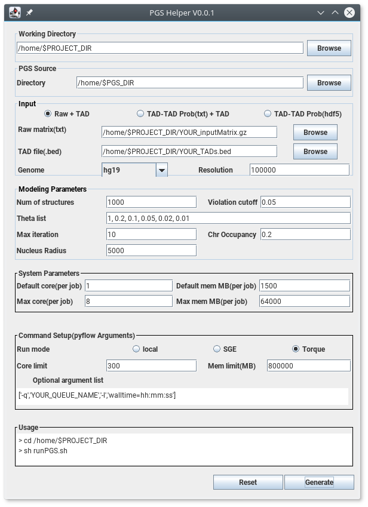
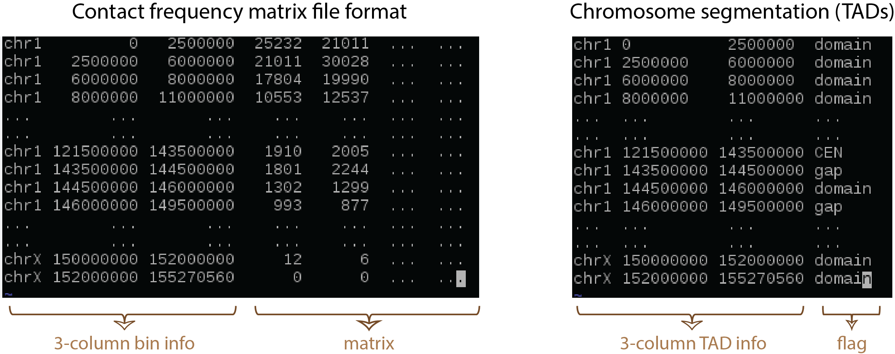

Quickstart
==========

Installation
------------

Requirements:

- Python 2.7
- Python packages ``numpy``, ``scipy``, ``pandas``, ``h5py``, ``matplotlib`` , ``seaborn``
- IMP (`Integrative Modeling Package`_.)

.. _Integrative Modeling Package: https://integrativemodeling.org/

Conda package is recommended to install all the requirements. Either `Anaconda <https://www.continuum.io/downloads>`_ or 
the minimal `Miniconda <http://conda.pydata.org/miniconda.html>`_ are suitable for managing required packages including IMP. If you use Miniconda, then you can install as follows:

::

    $ conda install numpy scipy pandas h5py matplotlib seaborn

Install IMP using conda:

::

    $ conda config --add channels salilab
    $ conda install imp

All other dependencies for imp and python packages will be automatically installed.

Then install PGS workflow packages:

::

    $ python setup.py install
    

To test if the installation goes well, the following command can be executed:

::

    $ cd test
    $ ./runPgs_workflow_test.sh
    

PGS Helper GUI
--------------

PGS package includes a Graphical User Interface (GUI) based helper program for user to run PGS easily. 
With this, a user can generate a command script ``runPgs.sh`` and a configuration file ``input_config.json``.

.. tip:: PGS Helper uses `Java Runtime Envrionment <http://www.oracle.com/technetwork/java/javase/downloads/index.html>`_, the latest Java SE 8 update is recommended. 

.. note:: PGS Helper is a convenient interface but not required to run PGS. We also provide the ``runPgs.sh`` and ``input_config.json`` examples that are easy to modify (`PGS Helper Output`_) without using the GUI. 

Using the PGS Helper
--------------------

To initialize PGS Helper:

::

    $ java -jar PGSHelper.jar

The following GUI will appear:

   

A. Working Directory
~~~~~~~~~~~~~~~~~~~~

Specify the project/working directory using the ``Browse`` button on right side. PGS will run in the specified project directory and all files, 
such as running script(i.e. ``runPGS.sh``), configuration file(i.e. ``input_config.json``),  log(i.e. ``pyflow.data``), and output results, 
will be stored in the directory.

B. PGS Source – Directory
~~~~~~~~~~~~~~~~~~~~~~~~~

Specify the directory of PGS source code using the ``Browse`` button on right side.

C. Input  
~~~~~~~~

.. note:: Currently our pipeline only support diploid genome, so chromosome Y is not supported and please don't include it in the input file. We will be updating the support for chromosome Y soon.

- Experiment data

  *Option 1 : Raw + TAD*
  
     * Raw contact matrix file (txt); the first three columns contain chromosome, start position (bp), and end position (bp) and followed by contact matrix (all numeric values must be **integers**; see figure above).
     * TAD_file (bed); a 4-column chromatin segmentation or TAD file, we adopt `bed file format <https://genome.ucsc.edu/FAQ/FAQformat.html>`_ while the 4-th column must contain "domain", "CEN", and "gap" (see figure above). 
  
  *Option 2 : TAD-TAD Prob(txt) + TAD*
  
     * Probability matrix file (txt); adopts the same format as the raw contact matrix file above, but the matrix contains probability values from 0 to 1.
     * TAD_file (bed); the format as figure above.
     
  *Option 3 : TAD-TAD Prob(hdf5)*
  
     * Probability matrix file (hdf5) : if a user have generated probability matrix using PGS (i.e. under old ``$PROJECT_DIR/result/probMat/probMat.hdf5.hmat``), then the user can use the previous probability matrix. This process will skip the first workflow, buildTADMap task. This option is good for replica calculations (in a new working directory, of course).

- Genome : the genome version of 3D models being constructed (current PGS supports only hg19 with chromosomes 1-22 and X).
- Resolution : the resolution of raw input data (in bp).

D. Modeling Parameters
~~~~~~~~~~~~~~~~~~~~~~

- Num of structures : the number of structures to generate. ``default = 1,000``
- Violation cutoff : violation cutoff. ``default = 0.05``
- Theta list : a probability list for step-wise optimizations; 1 < theta < 0. ``default = 1, 0.2, 0.1, 0.05, 0.02, 0.01``
- Max iteration : the number of maximum iterations for each theta. ``default = 10``

E. System Parameters
~~~~~~~~~~~~~~~~~~~~
In order to proceed efficiently, PGS submits both single-core and multi-thread jobs on HPC clusters (e.g. for the M-step and A-step jobs, respectively).
Thus the following parameters need to be specified.
- Default core : the number of cores to use for each regular job.
- Default MemMB : the memory (Mb) to use for each regular job. 
- Max cores : the number of cores to use for each multi-thread job.
- Max MemMB : the total memory (Mb) to use for each multi-thread job. 

F. Command Setup
~~~~~~~~~~~~~~~~

- Run mode : select a platform such as local computer, Sun Grid Engine (SGE) or Torque. 
- Core limit : the maximum number of cores for PGS to use (limited to user’s quota).
- Mem limit : the limit of memory for PGS to use.
- Optional argument list : additional options for each job to run/be assigned properly on the user’s HPC, such as queue name, running time, etc. Example arguments for PBS jobs: ``[‘-l’,’your_qname_here’,’-l’,’walltime=333:00:00’]``.
  Note that the option list will be applied to each job.

G. Generate Scripts 
~~~~~~~~~~~~~~~~~~~

Click the ``Generate`` button on the bottom to write a file (input_config.json) with the parameters on the working directory which has been specified by the user.
There will be a confirmation window with ``Yes`` or ``No`` button, and at this point the user can see a simple instruction in the ``Usage`` box. If ``Yes`` is clicked, then the GUI will be closed.

PGS Helper Output
-----------------

PGSHelper writes configuration in ``input_config.json``, and a shell script (``runPGS.sh``) under the project directory. 
The following describes the contents of those 2 files.

1. ``$PROJECT_DIR/input_config.json``

::

    {   "source_dir" : "[Directory name where pgs source is]",
        "input" : {
        "raw_matrix_file " : "[raw matrix file]",
            "TAD_file" : "[ TAD file, .bed format]",
            "resolution" : "[Resolution of input contact_map_file, e.g. 100000]",
            "genome" : "[Genome version, e.g. hg19]"
        },
        "output_dir" : "[Output Directory to store the results, e.g. $PROJECT_DIR/result]",
        
        "modeling_parameters" : {
            "theta_list" : [Theta list e.g, "1", "0.2", "0.1","0.05","0.02","0.01"],
            "num_of_structures" : [Number of structure to generate, e.g. 1000],
            "max_iter_per_theta" : [Max Iterations per job, e.g. 10],
            "violation_cutoff" : [Violation Cutoff, e.g. 0.05]
            "chr_occupancy" : [Chromosome Occupancy, e.g. 0.2]
            "nucleus_radius" : [Nucleus Radius (nm), e.g. 5000.0]
        },
        "system" : {
            "max_core" : [Maximum number of cores in a single node],
            "max_memMB" : [Maximum size of mem(MB) in a single node],
            "default_core" : [Default number of cores],
            "default_memMB" : [Default size of mem(MB)]
        }
    }

2. ``$PROJECT_DIR/runPGS.sh``

::

    python $PGS_DIRECTORY/pgs.py 
        --input_config $PROJECT_DIR/input_config.json 
        --run_mode [running platform] 
        --nCores 300 
        --memMb 800000 
        --pyflow_dir $PROJECT_DIR
        --schedulerArgList  ["-q","qname","-l","walltime=100:00:00"]

RUN PGS
-------

User can execute PGS under the project/working directory with the following command.

::

     $ sh runPgs.sh
    
